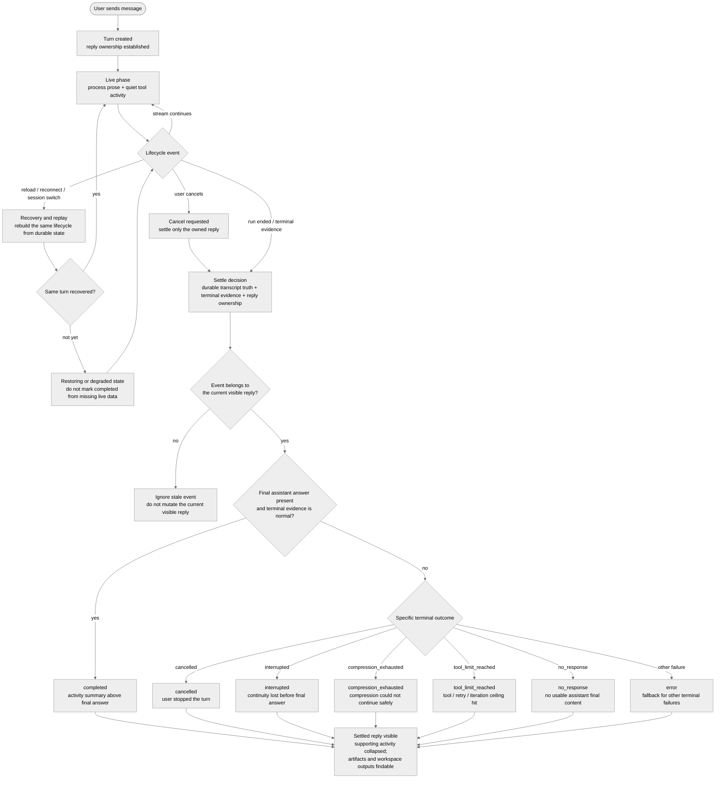

# 長時間エージェントセッションのための Live-to-Final アシスタント応答

- **Status:** Accepted（親コントラクト。実装は [#3400](https://github.com/nesquena/hermes-webui/issues/3400) で追跡）
- **Author:** @franksong2702
- **Created:** 2026-06-03
- **Tracking issue:** [#3400](https://github.com/nesquena/hermes-webui/issues/3400)

## 背景: 長時間セッションがアンカー

この RFC は、長時間エージェントセッションにおけるアシスタント応答のプロダクトモデルを定義します。

短い会話は依然有用な健全性チェックですが、最も難しいブラウザエージェント状態を行使しません。長時間セッションは次をし得ます:

- ユーザーを数分待たせる、
- 多数のツール呼び出しを行う、
- 長い最終回答を生む、
- ワークスペースアーティファクトを作成/更新する、
- Auto Compression の境界を越える、
- ツール呼び出し・リトライ・反復の上限に達する、
- ブラウザ・ネットワーク・SSE の継続性を失う、
- 起動がまだ競合中にユーザーのキャンセル/割り込み要求を受ける、
- ターンが落ち着く前にセッションを切り替えるか再読み込みする。

したがって設計はまず長時間ケースに対して判断されるべきです。短い会話は別個の UI モデルではなく、イベントの少ない同じライフサイクルであるべきです。

目標は Worklog ウィジェットの追加ではなく、Auto Compression や二重ストリーム所有権を見出しにすることでもありません。それらは補助スライスとエッジケースです。見出しは1つの一貫したアシスタント応答ライフサイクルです: ライブ作業、補助活動、終端結果、最終回答。

## プロダクト問題

Hermes WebUI は現在、1つのチャットサーフェスで複数の異なる意味を表現します:

- 作業がまだ実行中のアシスタントのライブプロセステキスト、
- その作業を支えるツール活動とライフサイクルステータス、
- 再読み込み・再接続・セッション切り替え後の復旧または replay 状態、
- キャンセル・割り込み・応答なし・ツール上限などの終端結果、
- ターンが落ち着いた後の最終回答。

これらの意味は同じ視覚スペースを繰り返し奪い合ってきました。一部の長時間セッションはノイジーに感じられ、一部はエージェント作業中に沈黙して見え、一部は再接続後に異なる形に復旧し、一部の終端エッジケースは最終回答が生まれていなくても完了したように見え得ます。

この RFC は、実装 PR とフォローアップ RFC が保つべきプロダクトセマンティクスを定義します。

## スコープ

### この RFC が所有するもの

- ライブ作業から最終または終端結果までの、1つのアシスタント応答の可視ライフサイクル。
- プロセス文章、ツール活動、ライフサイクルステータス、最終回答の間の境界。
- Auto Compression、最終回答なし、ツール/反復上限、キャンセル/割り込み、replay/再接続/セッション切り替え、生成アーティファクト/出力ハンドオフ、サイドバー/セッション所有権の長時間エッジケースセマンティクス。
- 作業を実装済みスライス、アクティブ PR、確定フォローアップ、子 RFC に分類すること。

### この RFC が所有しないもの

- ピクセルレベルのスタイリング。
- プロバイダー/モデル選択。
- 共有表示タイトルフィールドのようなバックエンドツールイベントスキーマの変更。
- 新しいランタイムアダプタ、ランナープロセス、ストレージ形式、SSE プロトコル。
- リッチなアーティファクト描画、実行可能 HTML、可視化プラグイン、Canvas 編集サーフェス。この RFC は、生成アーティファクトが応答ライフサイクルから見つけられ続ける方法のみを所有する。
- Queue、Steer、Stop-and-send、Interrupt の完全なコマンドセマンティクス。それらは [#3058](https://github.com/nesquena/hermes-webui/issues/3058) と [#3061](https://github.com/nesquena/hermes-webui/pull/3061) で追跡される pending-intent コントロールサーフェスコントラクトに属する。

## 公開インベントリ

このインベントリは、代表的な公開 issue と PR を、それが露呈する長時間セッションの懸念でグループ化します。リンクされた各項目がこの RFC で解決されるという主張ではありません。分類列は耐久的なスコープを記録し、現在の open/merged/superseded 状態ではありません: ライブステータスは追跡 issue [#3400](https://github.com/nesquena/hermes-webui/issues/3400) が権威です。

| 懸念 | 代表的なシグナル | 現在の分類 |
| --- | --- | --- |
| ライブ作業 vs 最終回答の境界 | [#536](https://github.com/nesquena/hermes-webui/issues/536), [#3400](https://github.com/nesquena/hermes-webui/issues/3400), [#3464](https://github.com/nesquena/hermes-webui/pull/3464) | 主プロダクトスコープ。#3464 が最初の RFC を着地。本ドキュメントはフォローアップスライスの親コントラクト。 |
| 最初の live-to-final 応答実装 | [#3401](https://github.com/nesquena/hermes-webui/pull/3401), [#3014](https://github.com/nesquena/hermes-webui/issues/3014), [#3015](https://github.com/nesquena/hermes-webui/pull/3015) | 最初の実装スライス。`Refs #3400` を使い続けるべき。統括は閉じない。 |
| Auto Compression の可視性とコンテキスト圧 | [#469](https://github.com/nesquena/hermes-webui/issues/469), [#2973](https://github.com/nesquena/hermes-webui/issues/2973), [#3079](https://github.com/nesquena/hermes-webui/issues/3079), [#3315](https://github.com/nesquena/hermes-webui/issues/3315), [#3316](https://github.com/nesquena/hermes-webui/pull/3316) | 補助エッジケース。実行中圧縮はライブライフサイクルステータス。圧縮枯渇/最終なしの確定は終端状態フォローアップ。 |
| Replay、再接続、セッション切り替え、再アタッチ | [#2283](https://github.com/nesquena/hermes-webui/pull/2283), [#2924](https://github.com/nesquena/hermes-webui/issues/2924), [#3391](https://github.com/nesquena/hermes-webui/pull/3391) | 補助復旧インフラ。プロダクト要件は replay 後も同じライフサイクル、または明示的な degraded/restoring 状態。 |
| ツール、活動、思考、可視進捗 | [#1298](https://github.com/nesquena/hermes-webui/issues/1298), [#3014](https://github.com/nesquena/hermes-webui/issues/3014), [#3015](https://github.com/nesquena/hermes-webui/pull/3015) | 主応答描画の懸念。プロセス文章が主役のまま。ツール/推論/デバッグ詳細は補助のまま。 |
| 最終なしと終端失敗の結果 | [#3315](https://github.com/nesquena/hermes-webui/issues/3315), [#3316](https://github.com/nesquena/hermes-webui/pull/3316) | 確定フォローアップ / アクティブ PR スコープ。ツール末尾や圧縮枯渇の run が、実最終回答なしに通常完了として落ち着いてはならない。 |
| キャンセルとストリーム所有権 | [#3344](https://github.com/nesquena/hermes-webui/issues/3344), [#3345](https://github.com/nesquena/hermes-webui/pull/3345), [#3475](https://github.com/nesquena/hermes-webui/issues/3475), [#3476](https://github.com/nesquena/hermes-webui/pull/3476) | 補助キャンセル/復旧スコープ。早期キャンセルワーカー調停は [#3476](https://github.com/nesquena/hermes-webui/pull/3476) で対応。フロントエンドのキャンセル owner-guard 強化が残るフォローアップ。 |
| 生成アーティファクトと出力ハンドオフ | [#2655](https://github.com/nesquena/hermes-webui/issues/2655), [#2673](https://github.com/nesquena/hermes-webui/pull/2673), [#2881](https://github.com/nesquena/hermes-webui/issues/2881), [#2938](https://github.com/nesquena/hermes-webui/pull/2938), [#3329](https://github.com/nesquena/hermes-webui/pull/3329), [#3348](https://github.com/nesquena/hermes-webui/pull/3348), [#3528](https://github.com/nesquena/hermes-webui/issues/3528) | 補助セッション出力の懸念。既存の Artifacts と `workspace://` サーフェスが生成ファイルを見つけられるようにする。長時間 replay/cancel/terminal 経路がそのハンドオフ復旧に必要なツールメタデータを失ってはならない。 |
| サイドバー/セッション所有権とアクティブセッション認識 | [#856](https://github.com/nesquena/hermes-webui/issues/856), [#1370](https://github.com/nesquena/hermes-webui/pull/1370), [#1436](https://github.com/nesquena/hermes-webui/issues/1436) | サイドバー/セッションメタデータが可視のアクティブターンと矛盾するときの確定フォローアップスコープ。 |
| ライブ作業中のユーザー介入 | [#720](https://github.com/nesquena/hermes-webui/issues/720), [#965](https://github.com/nesquena/hermes-webui/pull/965), [#1062](https://github.com/nesquena/hermes-webui/pull/1062), [#3058](https://github.com/nesquena/hermes-webui/issues/3058), [#3061](https://github.com/nesquena/hermes-webui/pull/3061) | 子 RFC スコープ。この親 RFC はコントロールが所有権・replay・終端の誠実さを保つことのみ要求。 |

## プロダクトモデル

### ライフサイクルフロー

下記のライフサイクルはプロダクト状態モデルであり、バックエンドスキーマやワイヤイベントコントラクトではありません。落ち着き時、可視の応答状態は、耐久的なトランスクリプト真実、利用可能な終端証拠、応答所有権から導出されるべきです。ターンは、ライブ活動や部分アシスタント文章が以前に存在したというだけで `completed` とマークすべきではありません。

> 注: 下記の Mermaid 図はレンダリングを保つため原文（英語ラベル）のまま掲載しています。

### 応答所有権

1つの可視アシスタント応答は、その run がアクティブな間、1つのユーザーターンと1つのアクティブな run/ストリームアイデンティティに属します。

要件:

- ライブイベントは、その run を所有するアシスタント応答にアタッチすべき。
- 同じセッションの後のターンが、古いストリームから stale なライブイベントを継承してはならない。
- バックグラウンドセッションは実行を続けられるが、そのライブストリームが別セッションの可視ペインを変えてはならない。
- 終端イベントは、それが属する同じターンを落ち着かせるか、ユーザーがそのセッションを見ていなければバックグラウンド/エラー経路を通すべき。
- サイドバー状態は可視の所有者と矛盾すべきでない。サイドバーがセッションを実行中と言うなら、開いたときライブ作業、restoring/degraded 状態、または誠実な終端状態を示すべき。

### ライブフェーズ

ターン実行中、アシスタント応答はライブプロセスナラティブとして読めるべき。

要件:

- プロセステキストが主タイムライン。
- ツール活動は可視だがプロセステキストより視覚的に静か。
- ツール行とツールグループはデフォルトで折りたたみ。
- 完全なコマンド、引数、生出力、大きなペイロードはより深い開示の背後。
- ユーザー向け進捗でない思考/推論が、作業が起きている唯一の可視シグナルであってはならない。
- run タイマー/ステータスは、トップトランスクリプトのアーティファクトではなくアクティブなライブターンに属する。
- 実行中のみのライフサイクルマーカーは一時的。
- 内部の復旧/制御メッセージは可視のチャット内容にならない。

### 落ち着きフェーズ

ターンが落ち着くとき、実装詳細は最終回答を飲み込まずに折りたたまれるべき。

要件:

- コンパクトな活動要約が最終回答の上に現れる。
- 活動要約はデフォルトで折りたたみ。
- 展開すると読みやすいプロセス履歴とツール履歴が現れる。
- 生のコマンド/出力詳細はより深い開示の背後のまま。
- 最終回答は要約の下の通常のアシスタント文章のまま。
- 実行中のみのマーカーは、可視のエラーや復旧結果を説明しない限り、落ち着いたトランスクリプトから消える。
- 非常に長い最終回答は完全で読みやすいまま。活動要約の中に隠したり、進捗/ステータスのアーティファクトに置き換えたりすべきでない。

### 復旧と replay

再読み込み、再接続、セッション切り替え、replay は同じ応答モデルを保つべき。

要件:

- 復旧されたセッションは、ライブ描画中に使われたのと同じ live/final 構造を再構築する。
- 再アタッチされたセッションが黙って別の視覚モデルに切り替わってはならない。
- 正確なライブシーンを即座に再構築できないなら、UI は空の実行中シェルではなく明示的な restoring または degraded 状態を示すべき。
- Replay は冪等でなければならない。トークン、進捗文章、推論、ツール行、圧縮行、終端カードを重複させてはならない。
- 古い進行中ブラウザ状態が耐久的なセッション真実を上書きしてはならない。
- 復旧/制御イベントは、ユーザー可視の終端結果を記述しない限り内部に留まる。

### 終端結果

すべてのターンに終端結果が必要。最終回答のないターンは通常完了した回答のように見えてはならない。

必須のプロダクト状態:

| 状態 | 意味 |
| --- | --- |
| `completed` | アシスタントが最終回答を生み、ターンが通常通り落ち着いた。 |
| `cancelled` | ユーザーがターンを停止した。 |
| `interrupted` | 最終回答が生まれる前にブラウザ、ストリーム、ワーカー、ランタイム、ネットワークの継続性が失われた。 |
| `compression_exhausted` | コンテキスト圧縮が安全に続けるための十分な余地を作れなかった。 |
| `tool_limit_reached` | 最終回答が生まれる前に run がツール呼び出し・リトライ・反復の上限に達した。 |
| `no_response` | プロバイダーまたはランタイムが使用可能なアシスタント最終内容を返さなかった。 |
| `error` | 上記に合わない失敗のフォールバック。 |

これらの識別子はプロダクト状態を名付けるもので、ワイヤ/enum や永続スキーマのコントラクトではありません。スコープと一貫し、この RFC はそれらにバックエンドフィールドやイベント形を義務付けません。コピーは進化し得ますが、これらのセマンティックな区別はライブ描画、落ち着き描画、replay で安定したままであるべきです。

複数の終端条件が当てはまるとき、より具体的な条件が一般的フォールバックに勝つべきです。例えば `cancelled`、`compression_exhausted`、`tool_limit_reached`、`no_response` は、ターンが最終回答を生まなかったというだけで素の `error` に潰してはなりません。

## 長時間エッジケース

### Auto Compression

Auto Compression はコンテキストライフサイクルの遷移であり、ツール呼び出しでも最終回答内容でもありません。

期待される挙動:

- ライブ作業中、圧縮を静かな一時ステータスとして示す。
- 圧縮後に run が続くとき、`Context auto-compressed` のような完了済み圧縮ステータスに収束する。
- 1つのターンが圧縮バリアを複数回越えるなら、各パスは圧縮を主トランスクリプトにせず理解可能であり続けるべき。
- エラーや復旧状態を説明しない限り、圧縮ステータステキストを落ち着いたトランスクリプトに残さない。
- 圧縮が十分な余地を作れないなら、通常完了ではなく `compression_exhausted` か別の具体的終端結果を表面化する。
- UI での圧縮成功は、それ自体ではモデル向けコンテキストが剪定されたことを証明しない。それは run-state 一貫性コントラクトがカバーするランタイム/コンテキスト不変条件のまま。

確定フォローアップスコープ:

- UI が後のストリームイベントから完了を推測する必要があるなら、明示的なパスごとの圧縮完了イベントを追加または標準化する。
- 圧縮枯渇/最終なしの処理を [#3315](https://github.com/nesquena/hermes-webui/issues/3315) と [#3316](https://github.com/nesquena/hermes-webui/pull/3316) に整合させ続ける。

### ツール呼び出し・リトライ・反復の上限

長時間セッションは、最終回答が得られる前にツール呼び出し上限、リトライ予算、反復上限を使い切り得ます。

期待される挙動:

- これらを通常完了ではなく明示的な終端結果として扱う。
- 上限に至った読みやすい作業履歴を保つ。
- 最終エリアを誠実に保つ: 最終回答をでっち上げるのではなく、上限到達で run が止まったと示す。
- ランタイムが使う内部の継続/制御プロンプトが、通常のユーザー作成トランスクリプト内容として残ってはならない。
- プロダクト状態は、上限がプロバイダーポリシー、Hermes Agent 反復予算、WebUI アダプタ/ランタイムポリシーのどれから来たかに依存すべきでない。

### 最終回答なしとプロバイダー失敗

ツール重視のターンは、ツール出力、プロバイダー失敗、使用可能な最終アシスタントメッセージなしで終わり得ます。

期待される挙動:

- 落ち着き時に最終アシスタント回答の不在を検出する。
- `no_response`、`interrupted`、`compression_exhausted`、`tool_limit_reached`、`error` のような終端状態を表面化する。
- 一部のアシスタント/ツール活動が以前に起きたというだけでターンを完了とマークしない。
- 内部のコンテキスト圧縮参照素材を最終アシスタント回答として扱わない。

### キャンセルと割り込み

キャンセルはユーザー可視の終端アクションで、単なるブラウザクリーンアップではありません。

期待される挙動:

- run が完全に始まる前にユーザーがキャンセルしても、バックエンドは可能な限りライブワーカー状態に対して調停する。
- ライブテキスト、推論、ツールが現れた後にユーザーがキャンセルしても、既に可視の作業を黙って失うべきでない。
- フロントエンドのキャンセル経路は、自身が所有する SSE ソースを閉じ、実際にキャンセルしたストリームの busy 状態のみをクリアすべき。
- キャンセルされたターンはプロバイダーの `no_response` ではなく `cancelled` として落ち着くべき。
- ネットワークやワーカーの割り込みは通常完了ではなく `interrupted` か restoring として落ち着くべき。

分類:

- [#3475](https://github.com/nesquena/hermes-webui/issues/3475) で追跡される早期起動キャンセルレースは [#3476](https://github.com/nesquena/hermes-webui/pull/3476) で対応。
- [#3344](https://github.com/nesquena/hermes-webui/issues/3344) と [#3345](https://github.com/nesquena/hermes-webui/pull/3345) で追跡される owner-aware なブラウザキャンセルクリーンアップは焦点を絞ったフォローアップのまま。

### 再接続とセッション切り替え

長時間作業はしばしば1つのブラウザアタッチメントより長く生きます。

期待される挙動:

- 離れて戻ると、既にストリームされたプロセス/ツール履歴を replay すべき。
- 再読み込みと再接続はアクティブターンのアイデンティティを保つべき。
- 遅い再構築は空白ではなく可視に restoring か degraded であるべき。
- サイドバー/セッションメタデータがユーザーを stale または誤ったアクティブセッションに向けるべきでない。
- Replay はフラット化された代替表現ではなくライブ描画と同じ可視ライフサイクルを使うべき。

確定フォローアップスコープ:

- 遅い再アタッチ中のより明確な restoring/degraded 状態。
- 現在の replay カーソル経路を置換または補完する準備ができたときのネイティブ `Last-Event-ID` または同等の再接続カーソルサポート。
- プロセス文章、ツール行、圧縮ステータス、終端状態についてライブと replay が同じライフサイクルを使うことを証明する追加テスト。

### ツールのみまたは低文章の run

一部の有効な長時間ターンは、特にモデルが密なツールシーケンスを実行するとき、最終回答前に可視のプロセス文章をほとんど/全く生まないことがあります。

期待される挙動:

- UI はアシスタント文章を捏造すべきでない。
- ツール活動は、ターンが空や壊れて見えない程度に読みやすいままであるべき。
- 空のプレースホルダは空白文章として描画するのでなくフィルタすべき。
- 最終回答が来ないなら、ツールリストだけを残すのでなく終端状態がその結果を説明すべき。

### 非常に長い最終回答

長時間セッションは、それ自体が長い最終回答で終わり得ます。

期待される挙動:

- 最終回答が主な落ち着いたアシスタント内容のまま。
- 補助活動はその上、デフォルトで折りたたみ。
- ストリーミングと落ち着きの遷移が、ユーザーを最終回答から飛ばしたり回答をツール出力のように見せたりすべきでない。
- 非常に長い最終回答への追加の折りたたみ、プレビュー、アウトライン、ナビゲーション操作は、完全な回答を通常のアシスタント文章として保たねばならない。

### 生成アーティファクトと出力ハンドオフ

長時間セッションはしばしばワークスペースにファイル（計画、レポート、パッチ、データファイル、生成 markdown、その他のアーティファクト）を作成・更新します。それらは最終回答テキストそのものでなくても、完了作業からユーザーが必要とするものの一部です。

期待される挙動:

- セッションの Artifacts タブや `workspace://` リンクのような既存アーティファクトサーフェスは、最終回答を置き換えるのでなく補助ナビゲーションサーフェスのまま。
- ターンがワークスペースアーティファクトを作成/編集するなら、落ち着いた応答がそれらの存在を隠したり見つけ不能にしたりすべきでない。
- 再接続、replay、セッション切り替え、キャンセル、割り込み、最終なしの終端経路は、同じアーティファクトハンドオフを再構築するのに十分なツール/アーティファクトメタデータを保つべき。
- 終端失敗は依然「最終回答なし」と「run 停止前に一部アーティファクトが生成された」を区別すべき。
- 大きな生成ファイルやリッチなアーティファクトタイプは、デフォルトで主チャットトランスクリプトに展開するのでなく、ワークスペース/アーティファクトプレビューモデルを通すべき。

確定フォローアップスコープ:

- アーティファクト復旧性をセッションスコープの Artifacts タブ作業 [#2655](https://github.com/nesquena/hermes-webui/issues/2655) と [#2673](https://github.com/nesquena/hermes-webui/pull/2673) に整合させ続ける。
- 最終回答のアーティファクトリンクを [#2881](https://github.com/nesquena/hermes-webui/issues/2881) と [#2938](https://github.com/nesquena/hermes-webui/pull/2938) の `workspace://` プレビュー経路に整合させ続ける。
- [#3528](https://github.com/nesquena/hermes-webui/issues/3528) のような割り込み/キャンセルでのツール履歴喪失を、アーティファクト再構築を妨げるとき live-to-final 復旧性バグとして扱う。

### サイドバーとセッション所有権

長時間セッションはチャットペインのみの懸念ではありません。サイドバーとセッションメタデータが、ユーザーがアクティブな作業と後の終端結果を見つけるのを助けます。

期待される挙動:

- セッション行の実行中インジケータは、stale な永続メタデータだけでなく、実際のアクティブ run か明確に復元可能な状態を反映すべき。
- バックグラウンドの完了、キャンセル、失敗は、ユーザーから可視ペインを奪わずに表現されるべき。
- セッション切り替えは保留ライブコンテキスト、進行中スナップショット、ツール履歴、終端結果状態を消すべきでない。
- メンテナンス書き込み、stale クリーンアップ、バックグラウンド修復は、意味あるユーザー/アシスタント活動が起きない限り古いセッションを新しくアクティブに見せるべきでない。

### ユーザー介入

長時間作業中、ユーザーはフォローアップ入力をキューしたり、現在の方向を steer したり、run を停止して置換を送ったりし得ます。

期待される挙動:

- これらのコントロールが live-to-final 応答ライフサイクルを破壊すべきでない。
- Queue/Steer/Stop-and-send/Interrupt のコマンドセマンティクスは別個のコントロールサーフェスコントラクトで定義すべき。
- この RFC は、ライブセッションコントロールが明確な所有権、終端結果、replay 可能な状態を保つことのみ要求。

現在の子コントラクトは [#3058](https://github.com/nesquena/hermes-webui/issues/3058) と [#3061](https://github.com/nesquena/hermes-webui/pull/3061) で追跡されます。その子 RFC が次のような問いを所有すべきです:

- 各スライスで Queue がブラウザバックかサーバーバックか、
- Queue がいつ Steer に昇格できるか、
- Stop-and-send が何を意味するか、
- 配信済み vs 適用済みの Steer がどう表現されるか、
- run 終了後の残余 Steer に何が起きるか。

## 提供とフォローアップマップ

このマップを使って実装 PR と子 RFC のスコープを保ってください。「vehicle」列は耐久的なトラックを名付け、ライブのマージ状態ではありません。現在の open/merged/superseded ステータスは追跡 issue [#3400](https://github.com/nesquena/hermes-webui/issues/3400) が権威です。

| トラック | スコープ | 現在の vehicle |
| --- | --- | --- |
| 親プロダクト RFC | 長時間の live-to-final アシスタント応答ライフサイクルとレビューチェックリストを定義。 | 本 RFC。追跡 issue [#3400](https://github.com/nesquena/hermes-webui/issues/3400)。 |
| 最初の応答ライフサイクル実装 | ライブプロセス文章、静かなツール活動、最終回答の上の落ち着いた活動要約、replay/再アタッチ一貫性、ライブのみ圧縮ステータス、補助ストリーム所有権修正。 | [#3401](https://github.com/nesquena/hermes-webui/pull/3401)。 |
| 終端/最終なし安定化 | 圧縮枯渇、ツール末尾/最終なしのトランスクリプト形、コンテキスト圧縮マーカー抑制、終端エラールーティング。 | [#3315](https://github.com/nesquena/hermes-webui/issues/3315), [#3316](https://github.com/nesquena/hermes-webui/pull/3316)。 |
| キャンセル所有権強化 | フロントエンドキャンセルが自身の SSE ソースを閉じ、自身の busy 状態のみクリアすべき。 | [#3344](https://github.com/nesquena/hermes-webui/issues/3344), [#3345](https://github.com/nesquena/hermes-webui/pull/3345)。 |
| 早期キャンセル起動レース | SSE レジストリが起動完全確定前にデタッチしても、バックエンドキャンセルが依然ワーカーを割り込むべき。 | [#3475](https://github.com/nesquena/hermes-webui/issues/3475), [#3476](https://github.com/nesquena/hermes-webui/pull/3476)。 |
| Pending-intent コントロールサーフェス | Queue、Steer、Stop-and-send、Interrupt、配信済み/適用済み/残余のセマンティクス。 | [#3058](https://github.com/nesquena/hermes-webui/issues/3058), [#3061](https://github.com/nesquena/hermes-webui/pull/3061)。 |
| 再アタッチと replay 磨き込み | 遅い再構築の degraded 状態、replay/body タイミング、ネイティブカーソルサポート、replay を通した同じライフサイクル。 | プロトコルセマンティクスが拡張するならフォローアップ issue/PR か子 RFC。 |
| ツール上限と最大反復の終端状態 | 上限到達状態、制御プロンプトの可視性、偽の最終回答なし。 | フォローアップ issue/PR。ランタイムが上限シグナルを所有するなら Hermes Agent が関わり得る。 |
| アーティファクトハンドオフと復旧性 | 最終/終端応答と、ターン中に作成/編集されたワークスペースアーティファクトのリンクを保つ。 | 既存の Artifacts と `workspace://` サーフェス。replay/cancel/terminal 経路がアーティファクトメタデータを失うときフォローアップ issue/PR。 |
| サイドバー/セッション所有権 | セッション行のアクティブ/終端状態、stale スピナー修復、セッション一覧消失、バックグラウンド終端フィードバック。 | セッション/ランタイムコントラクト下のフォローアップ issue/PR。 |
| 非常に長い最終回答の使い勝手 | 最終回答を通常文章として保つ任意のナビゲーション/アウトライン/プレビュー操作。 | オープンなプロダクト議論。実装 vehicle はまだなし。 |

## 既存コントラクトとの関係

この RFC は現在のランタイム、復旧、アダプタのコントラクトの上に位置します:

- [`webui-run-state-consistency-contract.md`](webui-run-state-consistency-contract.md) は、トランスクリプト、コンテキスト、ストリーム、replay、圧縮、セッションメタデータがどう一貫を保つかを定義。
- [`canonical-session-resolution.md`](canonical-session-resolution.md) は、URL、ローカルブラウザ状態、サイドバー行、圧縮系統が1つの可視セッションターゲットにどう解決するかを定義。
- [`turn-journal.md`](turn-journal.md) は、クラッシュ安全な送信ターンと割り込みターンの復旧セマンティクスを定義。
- [`hermes-run-adapter-contract.md`](hermes-run-adapter-contract.md) は、より長期的なイベント/制御所有権と移行ゲートを定義。

この RFC は、それらの下位コントラクトが長時間アシスタント応答について保つ必要のあるプロダクト的意味を定義します。

[#3058](https://github.com/nesquena/hermes-webui/issues/3058) と [#3061](https://github.com/nesquena/hermes-webui/pull/3061) で追跡される pending-intent コントロールサーフェス RFC は子コントラクトとして扱うべきです: live-to-final 応答ライフサイクルを再定義せずにユーザー介入セマンティクスを定義できます。

## レビューチェックリスト

この RFC に対して PR をレビューするとき、このチェックリストを使う:

- 変更は長時間セッションの可読性を保つか?
- ライブプロセステキストがツールメタデータより主役のままか?
- ツール詳細は主トランスクリプトにならずに利用可能か?
- 最終回答は補助活動と分離されたままか?
- 圧縮、最終なし、ツール上限、キャンセル、割り込みの結果が誠実に分類されているか?
- 再接続/セッション切り替えが同じ応答ライフサイクルを再構築するか、明示的に degrade するか?
- ターンがワークスペースアーティファクトを生成したなら、落ち着き・replay・再接続・キャンセル・終端失敗の後もユーザーがそれらを見つけられるか?
- 内部の復旧や制御メッセージが通常のチャット内容の外に留まるか?
- サイドバー/セッション状態が可視のアクティブまたは終端ターンと一致するか?
- PR のスライスが明確か: ライフサイクル、終端/復旧、キャンセル所有権、ライブコントロール、サイドバー/セッション所有権、プロトコル統合?
- 変更が Queue/Steer/Stop-and-send/Interrupt に属するなら、この親 RFC 内に隠すのでなく子コントロールサーフェス RFC にルーティングされているか?

## オープンな問い

オープンな問いは、この RFC、アクティブな実装 PR、子 RFC で既に決まっていないプロダクト選択に限られます。

- 非常に長い最終回答は、標準チャットトランスクリプト挙動を超える追加のナビゲーション、アウトライン、プレビュー操作を得るべきか? そうなら、何のしきい値がそれをトリガーし、回答を通常のアシスタント文章としてどう保つか?
- ターンが複数のワークスペースアーティファクトを生むとき、最終回答に自動アーティファクト要約やナビゲーション操作を含めるべきか、それとも既存の Artifacts タブと明示的 `workspace://` リンクに頼るべきか?
- ユーザーが別セッションを見ていた間に完了・失敗・キャンセル・注意が必要になったバックグラウンド長時間セッションの、最小のサイドバーシグナルは何か?
- どの終端結果がインライン復旧アクション（retry、continue、詳細検査、チェックポイントから再オープン）を提供すべきで、どれが情報提供のみのままであるべきか?

---

> 本ドキュメントは hermes-webui 公式リポジトリ `docs/rfcs/live-to-final-assistant-replies.md` の日本語訳です。ステータス・状態識別子・Issue/PR 番号・識別子・コマンド名は原文のまま表記しています。Mermaid 図はレンダリングを保つため原文（英語ラベル）のまま掲載しています。
