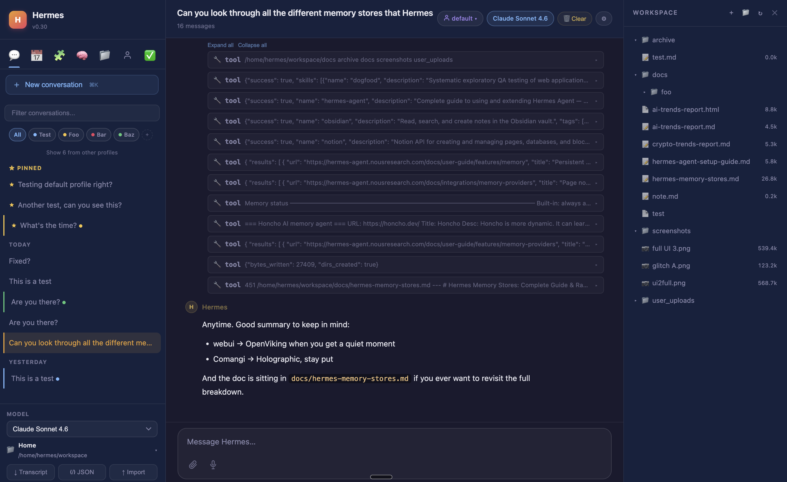

# Hermes Web UI

[Hermes Agent](https://hermes-agent.nousresearch.com/) は、あなたのサーバー上に常駐し、ターミナルやメッセージングアプリ経由でアクセスする高度な自律エージェントです。学んだことを覚え、長く動かすほど能力が高まります。

Hermes WebUI は、[Hermes Agent](https://hermes-agent.nousresearch.com/) 用の、ブラウザで動く軽量・ダークテーマの Web アプリインターフェースです。CLI 体験と完全に同等 — ターミナルでできることはすべてこの UI でできます。ビルドステップなし、フレームワークなし、バンドラなし。Python と vanilla JS だけです。

レイアウトは3ペイン。左サイドバーはセッションとナビゲーション、中央はチャット、右はワークスペースのファイル参照。モデル・プロファイル・ワークスペースのコントロールは **コンポーザのフッター** にあり、入力中は常に見えています。円形のコンテキストリングがトークン使用量を一目で示します。すべての設定とセッションツールは **Hermes Control Center**（サイドバー下部のランチャー）にあります。


<table>
  <tr>
    <td width="50%" align="center">
      
      <br /><sub>フルプロファイル対応のライトモード</sub>
    </td>
    <td width="50%" align="center">
      
      <br /><sub>設定のカスタマイズ、パスワード設定</sub>
    </td>
  </tr>
</table>

<table>
  <tr>
    <td width="50%" align="center">
      
      <br /><sub>インラインプレビュー付きワークスペースファイルブラウザ</sub>
    </td>
    <td width="50%" align="center">
      
      <br /><sub>セッションのプロジェクト、タグ、ツール呼び出しカード</sub>
    </td>
  </tr>
</table>

これにより、**便利な Web UI から Hermes CLI とほぼ 1:1 同等** の操作ができ、Hermes 構成への SSH トンネル経由で安全にアクセスできます。起動はワンコマンド、自分のコンピュータからのアクセス用 SSH トンネルもワンコマンド。Web UI のあらゆる部分が、既存の Hermes エージェントと既存のモデルを使い、追加セットアップを一切要しません。

---

## 目次

- [なぜ Hermes か](#なぜ-hermes-か) — 何であるか、どう比較されるか
- [クイックスタート](#クイックスタート) — clone ＋ `bootstrap.py` / `start.sh` / `ctl.sh`
- [機能](#機能) — チャット、セッション、ワークスペース、音声、プロファイル、セキュリティ、テーマ、パネル、モバイル
- [設定とアクセス](#設定とアクセス) — 自動検出、上書き、リモート/Tailscale/スマホ、手動起動
- [Docker](#docker) — シングル/マルチコンテナデプロイ
- [テストの実行](#テストの実行)
- [アーキテクチャ](#アーキテクチャ) — バックエンド/フロントエンド構成、状態ディレクトリ
- [ドキュメント](#ドキュメント) — 完全なドキュメント索引
- [コントリビューター](#コントリビューター)

---

## なぜ Hermes か

ほとんどの AI ツールはセッションごとにリセットされます。あなたが誰か、何に取り組んでいたか、プロジェクトがどんな規約に従うかを知りません。毎回自分を説明し直すことになります。

Hermes はセッションをまたいでコンテキストを保持し、あなたがオフラインの間もスケジュールジョブを実行し、長く動かすほどあなたの環境に賢くなります。既存の Hermes エージェント構成、既存のモデルを使い、開始に追加設定を要しません。

他のエージェント型ツールと異なる点:

- **永続メモリ** — user profile、エージェントのメモ、再利用可能な手順を保存するスキルシステム。Hermes はあなたの環境を学習し、学び直す必要がない
- **セルフホストのスケジューリング** — あなたがオフラインの間に発火し、結果を Telegram、Discord、Slack、Signal、メールなどへ届ける cron ジョブ
- **10以上のメッセージングプラットフォーム** — ターミナルで使える同じエージェントにスマホから到達できる
- **自己改善型スキル** — Hermes は経験から自分のスキルを自動的に記述・保存する。閲覧するマーケットプレイスも、インストールするプラグインもない
- **プロバイダー非依存** — OpenAI、Anthropic、Google、DeepSeek、OpenRouter など
- **他エージェントのオーケストレーション** — 重いコーディングタスクのために Claude Code や Codex を起動し、その結果を自身のメモリに取り込める
- **セルフホスト** — あなたの会話、あなたのメモリ、あなたのハードウェア

**フィールド比較** *(状況は活発に変化中 — 完全な内訳は [docs/why-hermes.md](../docs/why-hermes.md) を参照)*:

| | OpenClaw | Claude Code | Codex CLI | OpenCode | Hermes |
|---|---|---|---|---|---|
| 永続メモリ（自動） | あり | 部分的† | 部分的 | 部分的 | あり |
| スケジュールジョブ（セルフホスト） | あり | なし‡ | なし | なし | あり |
| メッセージングアプリ連携 | あり（15以上） | 部分的（Telegram/Discord preview） | なし | なし | あり（10以上） |
| Web UI（セルフホスト） | ダッシュボードのみ | なし | なし | あり | あり |
| 自己改善型スキル | 部分的 | なし | なし | なし | あり |
| Python / ML エコシステム | なし（Node.js） | なし | なし | なし | あり |
| プロバイダー非依存 | あり | なし（Claude のみ） | あり | あり | あり |
| オープンソース | あり（MIT） | なし | あり | あり | あり |

† Claude Code は CLAUDE.md / MEMORY.md のプロジェクトコンテキストとローリングな auto-memory を持つが、完全な自動セッション横断リコールではない
‡ Claude Code はクラウド管理のスケジューリング（Anthropic インフラ）とセッションスコープの `/loop` を持つ。セルフホスト cron はない

**最も近い競合は OpenClaw** — 両者ともメモリ・cron・メッセージングを備えた常時稼働・セルフホスト・オープンソースのエージェントです。主な違い: Hermes は自分のスキルを中核挙動として自動的に記述・保存する（OpenClaw のスキルシステムはコミュニティマーケットプレイス中心）。Hermes はアップデート間でより安定（OpenClaw はリリース回帰が記録され、ClawHub には悪意あるスキルのセキュリティ事件があった）。そして Hermes は Python エコシステムでネイティブに動く。完全な対比は [docs/why-hermes.md](../docs/why-hermes.md) を参照してください。

---

## クイックスタート

リポジトリの bootstrap を実行します:

```bash
git clone https://github.com/nesquena/hermes-webui.git hermes-webui
cd hermes-webui
python3 bootstrap.py
```

またはシェルランチャーを使い続けます:

```bash
./start.sh
```

セルフホストの VM やホームラボのインストールでは、`ctl.sh` が `fuser` や `pkill` なしで一般的なデーモンライフサイクルコマンドをラップします:

```bash
./ctl.sh start              # バックグラウンドデーモン、PID は ~/.hermes/webui.pid
./ctl.sh status             # PID、稼働時間、バインド host/port、ログパス、/health
./ctl.sh logs --lines 100   # ~/.hermes/webui.log を tail
./ctl.sh restart
./ctl.sh stop
```

`ctl.sh start` は bootstrap をフォアグラウンド/ノーブラウザモードでデーモンラッパーの背後で実行し、ログを `~/.hermes/webui.log` に書き、`.env` と `HERMES_WEBUI_HOST=0.0.0.0 ./ctl.sh start` のようなインライン上書きを尊重します。

### 上級: 動的リコール prefill ＆ Gateway 経由チャット

2つの任意のセルフホストデプロイ機能 — ブラウザターンへ動的な **セッションリコール prefill** を付加（Joplin/Obsidian/Notion/llm-wiki ルーター）、ブラウザチャットを稼働中の **Hermes Gateway** 経由でルーティング — は [`docs/advanced-chat-setup.md`](../docs/advanced-chat-setup.md) に文書化されています。ほとんどのユーザーはどちらも不要です。

bootstrap は次を行います:

1. Hermes Agent を検出し、無ければ公式インストーラを試みる（`curl -fsSL https://raw.githubusercontent.com/NousResearch/hermes-agent/main/scripts/install.sh | bash`）。
2. WebUI 依存を持つ Python 環境を見つけるか作成する。
3. Web サーバーを起動し `/health` を待つ。
4. `--no-browser` を渡さない限りブラウザを開く。
5. WebUI 内の初回オンボーディングウィザードへ案内する。

> ネイティブ Windows はこの bootstrap でまだ非対応です。Linux、macOS、WSL2 を使ってください。
> Windows / WSL のログイン時自動起動は [`docs/wsl-autostart.md`](../docs/wsl-autostart.md) を参照。

コミュニティ保守のネイティブ Windows セットアップは [@markwang2658/hermes-windows-native-guide](https://github.com/markwang2658/hermes-windows-native-guide)（コンパニオン setup リポジトリ: [@markwang2658/hermes-windows-native](https://github.com/markwang2658/hermes-windows-native)）に文書化されています。[#1952](https://github.com/nesquena/hermes-webui/issues/1952) のコミュニティ報告からのメモ:

- **メモリ:** コミュニティ計測でネイティブ約 330 MB に対し WSL2+Docker は約 1080 MB（構成により変動）。
- **動くもの:** チャット、ワークスペースブラウザ、セッション管理、全テーマ。
- **既知の制限:** ワークスペースブラウザに一部 POSIX 形式のファイルパスが現れる。bash を前提とするエージェントツールはネイティブで動かない場合がある。
- **ネイティブ Windows セットアップ:** Python 3.11+ をインストールし、PowerShell で hermes-agent ルートから `python -m venv venv` → `pip install -r requirements.txt` → `pwsh .\start.ps1`（`venv\Scripts\python.exe` を自動検出）。
- **WSL2 との関係:** 前提条件ではない — WSL2 でビルドした venv（`venv/bin/python`、ELF）はネイティブ Windows Python から呼べないため、上記のネイティブセットアップを使う。完全な `bootstrap.py` ＋ Linux ランタイムが欲しい場合、WSL2 は並行インストールとして引き続き有用。

インストール後もプロバイダー設定が未完了の場合、オンボーディングウィザードは、ブラウザ内で完全な CLI セットアップを再現しようとする代わりに、`hermes model` で完了するよう案内します。
ウィザード、プロバイダー選択、ローカルモデルサーバーの Base URL、安全な再実行のステップごとの解説は [`docs/onboarding.md`](../docs/onboarding.md) を参照。
AI アシスタントがインストール、再インストール、bootstrap、プロバイダー設定、初回起動サポートを手伝う場合は、コマンド実行やログ調査の前に [`docs/onboarding-agent-checklist.md`](../docs/onboarding-agent-checklist.md) を読ませてください。

---

## 機能

### チャットとエージェント
- SSE 経由のストリーミング応答（トークンは生成されるそばから表示）
- マルチプロバイダーのモデル対応 — 任意の Hermes API プロバイダー（OpenAI、Anthropic、Google、DeepSeek、Nous Portal、OpenRouter、MiniMax、Xiaomi MiMo、Z.AI）。設定済みキーから動的に埋まるモデルドロップダウン
- 処理中にメッセージを送信 — 自動でキューされる
- 過去の任意のユーザーメッセージをインライン編集し、その地点から再生成
- 直前のアシスタント応答をワンクリックでリトライ
- 稼働中タスクをコンポーザフッターから直接キャンセル（Send 隣の Stop ボタン）
- インラインのツール呼び出しカード — ツール名・引数・結果スニペットを表示。複数ツールターン用に展開/折りたたみ一括トグル
- サブエージェント委任カード — 子エージェントの活動を独自アイコンとインデントボーダーで表示
- インラインの Mermaid 図描画（フローチャート、シーケンス図、ガントチャート）
- 思考/推論表示 — Claude の extended thinking と o3 の推論ブロック用の折りたたみ可能な金色テーマカード
- 危険な shell コマンドの承認カード（一度だけ許可 / セッション / 常に / 拒否）
- ネットワークの瞬断時の SSE 自動再接続（SSH トンネルの耐障害性）
- ファイル添付はページ再読み込みをまたいで保持され、デフォルトでアクティブワークスペースの外に保存（`~/.hermes/webui/attachments/<session_id>/`、設定時は `HERMES_WEBUI_ATTACHMENT_DIR/<session_id>/`）
- メッセージタイムスタンプ（各メッセージ横に HH:MM、ホバーで完全な日付）
- 「Copied!」フィードバック付きコードブロックコピーボタン
- Prism.js によるシンタックスハイライト（Python、JS、bash、JSON、SQL など）
- AI 応答内の安全な HTML 描画（bold、italic、code を markdown に変換）
- 長い応答中の描画を滑らかにする rAF スロットル付きトークンストリーミング
- コンポーザフッターのコンテキスト使用量インジケータ — トークン数、コスト、充填バー（モデル対応）

### セッション
- 作成、リネーム、複製、削除、タイトルとメッセージ内容での検索
- セッションごとの `⋯` ドロップダウンによるアクション — ピン留め、プロジェクトへ移動、アーカイブ、複製、削除
- セッションのピン留め/スター（サイドバー上部、金色インジケータ）
- セッションのアーカイブ（削除せず隠す、トグルで表示）
- セッションプロジェクト — セッション整理用の色付き名前グループ
- セッションタグ — タイトルに #tag を付けて色付きチップとクリックフィルタ
- サイドバーで Today / Yesterday / Earlier にグループ化（折りたたみ可能な日付グループ）
- Markdown トランスクリプト、完全な JSON エクスポート、JSON インポート
- セッションはページ再読み込みと SSH トンネル再接続をまたいで保持
- ブラウザタブのタイトルがアクティブなセッション名を反映
- CLI セッションブリッジ — hermes-agent の SQLite ストアからの CLI セッションが金色の "cli" バッジ付きでサイドバーに表示。クリックで完全な履歴付きインポートし通常通り返信
- トークン/コスト表示 — 入力トークン、出力トークン、推定コストを会話ごとに表示（Settings または `/usage` コマンドでトグル）

### ワークスペースファイルブラウザ
- 展開/折りたたみ可能なディレクトリツリー（シングルクリックでトグル、ダブルクリックでナビゲート）
- クリック可能なパスセグメント付きパンくずナビゲーション
- テキスト、コード、Markdown（描画済み）、画像のインラインプレビュー
- `workspace://path/to/file` を使ったチャットリンクで右側プレビューペインにファイルを開く
- ファイルの編集、作成、削除、リネーム。フォルダ作成
- バイナリファイルのダウンロード（サーバーが自動検出）
- ディレクトリ移動時にファイルプレビューを自動クローズ（未保存編集ガード付き）
- Git 検出 — ワークスペースヘッダにブランチ名と dirty ファイル数バッジ
- 右パネルはドラッグでリサイズ可能
- シンタックスハイライト付きコードプレビュー（Prism.js）

### 音声入力
- コンポーザのマイクボタン（Web Speech API）
- タップで録音、再タップまたは送信で停止
- ライブの暫定文字起こしがテキストエリアに表示
- 約2秒の無音後に自動停止
- 既存のテキストエリア内容に追記（置換しない）
- ブラウザが Web Speech API 非対応のとき非表示（Chrome、Edge、Safari）

### プロファイル
- **コンポーザフッター** のプロファイルチップ — gateway 状態とモデル情報付きで全プロファイルを表示するドロップダウン
- gateway 状態ドット（緑＝稼働中）、モデル情報、プロファイルごとのスキル数
- プロファイル管理パネル — サイドバーからの作成、切り替え、削除
- 作成時にアクティブプロファイルから config をクローン
- 作成時の任意カスタムエンドポイントフィールド — Base URL と API キーを作成時にプロファイルの `config.yaml` に書き込み。Ollama、LMStudio、その他ローカルエンドポイントをファイル手編集なしで設定可能
- シームレスな切り替え — サーバー再起動なし。config、skills、memory、cron、models を再読み込み
- セッションごとのプロファイル追跡（作成時にどのプロファイルがアクティブだったか記録）

### 認証とセキュリティ
- 任意のパスワード認証 — デフォルトオフ、localhost ではゼロ摩擦
- `HERMES_WEBUI_PASSWORD` 環境変数または Settings パネルで有効化
- 任意の passkeys/WebAuthn — パスワードでサインイン後に Settings → System から登録。ログインページは passkey が1つ以上存在する場合のみ passkey サインインを表示
- passkey を1つ以上登録後、Settings → System でパスワードを削除し passkey のみのサインインを有効に保てる。passkey にする前まではパスワード認証が bootstrap/復旧経路として残る。passkey は same-origin で WebUI 状態ディレクトリにローカル保存
- 24時間 TTL の署名付き HMAC HTTP-only Cookie
- `/login` の最小限ダークテーマログインページ
- 全レスポンスのセキュリティヘッダ（X-Content-Type-Options、X-Frame-Options、Referrer-Policy）
- 20MB の POST ボディサイズ上限
- SRI integrity ハッシュで固定された CDN リソース

### テーマ
- 外観は2軸に分割: Theme（`system`、`dark`、`light`）と Skin（`default`、`ares`、`mono`、`slate`、`poseidon`、`sisyphus`、`charizard`、`sienna`、`catppuccin`、`nous`、`geist-contrast` / Geist Contrast）
- Settings → Appearance（即時ライブプレビュー）または `/theme <theme-or-skin>` で切り替え
- 再読み込みをまたいで保持（サーバー側 settings.json ＋ちらつきのない読み込み用 localStorage）
- スキンは `data-skin` ＋ CSS 変数を使う。ダークモードは `data-theme` のカスタムテーマ軸ではなく `.dark` クラスで解決 — [THEMES.md](THEMES.md) を参照

### 設定とコンフィグ
- **Hermes Control Center**（サイドバーランチャーボタン） — Conversation タブ（export/import/clear）、Preferences タブ（モデル、送信キー、テーマ、言語、全トグル）、System タブ（バージョン、パスワード）
- 送信キー: Enter（デフォルト）または Ctrl/Cmd+Enter
- CLI セッション表示/非表示トグル（デフォルト有効）
- トークン使用量表示トグル（デフォルトオフ、`/usage` コマンドでも）
- Control Center は常に Conversation タブで開き、閉じるとリセット
- 未保存変更ガード — 未永続の変更がある状態で閉じると discard/save プロンプト
- cron 完了アラート — トースト通知と Tasks タブの未読バッジ
- バックグラウンドエージェントエラーアラート — 非アクティブセッションがエラーに遭遇するとバナー

### スラッシュコマンド
- コンポーザで `/` を入力するとオートコンプリートドロップダウン
- 組み込み: `/help`、`/clear`、`/compress [focus topic]`、`/compact`（エイリアス）、`/model <name>`、`/workspace <name>`、`/new`、`/usage`、`/theme`
- 矢印キーでナビゲート、Tab/Enter で選択、Escape で閉じる
- 認識されないコマンドはエージェントへ通過

### パネル
- **Chat** — セッション一覧、検索、ピン、アーカイブ、プロジェクト、新規会話
- **Tasks** — cron ジョブの表示、作成、編集、実行、一時停止/再開、削除。実行履歴。完了アラート
- **Skills** — カテゴリ別の全スキル一覧、検索、プレビュー、作成/編集/削除。リンクファイルビューア
- **Memory** — MEMORY.md と USER.md のインライン表示・編集
- **Profiles** — エージェントプロファイルの作成、切り替え、削除。config クローン
- **Todos** — 現在のセッションのライブタスクリスト
- **Spaces** — ワークスペースの追加、リネーム、削除。トップバーからのクイック切り替え

### モバイルレスポンシブ
- ハンバーガーサイドバー — モバイル（<640px）でスライドインオーバーレイ
- サイドバー上部タブはモバイルでも利用可能。チャットの高さを奪う固定ボトムナビなし
- 右端からのファイルスライドオーバーパネル
- すべての対話要素でタッチターゲット最小 44px
- ボトムナビ間隔のないスマホでの全高チャット/コンポーザ
- デスクトップレイアウトは完全に不変

---

## 設定とアクセス

`start.sh` はほぼすべてを自動検出します。以下の各節は、できない場合のつまみと、UI へのリモート到達方法を扱います。

### start.sh が自動検出するもの

| 対象 | 検出方法 |
|---|---|
| Hermes エージェントディレクトリ | `HERMES_WEBUI_AGENT_DIR` 環境変数、次に `$HERMES_HOME/hermes-agent`（Windows デフォルト `%LOCALAPPDATA%\hermes\hermes-agent`、POSIX デフォルト `~/.hermes/hermes-agent`）、次に兄弟 `../hermes-agent` |
| Python 実行ファイル | エージェント venv 優先、次に本リポジトリの `.venv`、次にシステム `python3` |
| 状態ディレクトリ | `HERMES_WEBUI_STATE_DIR` 環境変数、次に `$HERMES_HOME/webui`（Windows デフォルト `%LOCALAPPDATA%\hermes\webui`、POSIX デフォルト `~/.hermes/webui`） |
| デフォルトワークスペース | `HERMES_WEBUI_DEFAULT_WORKSPACE` 環境変数、次に `~/workspace`、次に状態ディレクトリ |
| ポート | `HERMES_WEBUI_PORT` 環境変数または第1引数、デフォルト `8787` |

検出がすべて見つかれば、他に何も要りません。

---

### 上書き（自動検出が外したときのみ必要）

```bash
export HERMES_WEBUI_AGENT_DIR=/path/to/hermes-agent
export HERMES_WEBUI_PYTHON=/path/to/python
export HERMES_WEBUI_PORT=9000
export HERMES_WEBUI_AUTO_INSTALL=1  # エージェント依存の自動インストールを有効化（デフォルト無効）
./start.sh
```

またはインライン:

```bash
HERMES_WEBUI_AGENT_DIR=/custom/path ./start.sh 9000
```

環境変数の全リスト:

| 変数 | デフォルト | 説明 |
|---|---|---|
| `HERMES_WEBUI_AGENT_DIR` | 自動検出 | hermes-agent チェックアウトのパス |
| `HERMES_WEBUI_PYTHON` | 自動検出 | Python 実行ファイル |
| `HERMES_WEBUI_HOST` | `127.0.0.1` | バインドアドレス（全 IPv4 は `0.0.0.0`、全 IPv6 は `::`、IPv6 ループバックは `::1`） |
| `HERMES_WEBUI_PORT` | `8787` | ポート |
| `HERMES_WEBUI_STATE_DIR` | `$HERMES_HOME/webui`（Windows デフォルト `%LOCALAPPDATA%\hermes\webui`、POSIX デフォルト `~/.hermes/webui`） | セッションと状態の保存先 |
| `HERMES_WEBUI_DEFAULT_WORKSPACE` | `~/workspace` | デフォルトワークスペース |
| `HERMES_WEBUI_DEFAULT_MODEL` | *(プロバイダーデフォルト)* | 任意のモデル上書き。アクティブな Hermes プロバイダーのデフォルトを使うには未設定のままに |
| `HERMES_WEBUI_PASSWORD` | *(未設定)* | パスワード認証を有効化するために設定 |
| `HERMES_WEBUI_CSP_CONNECT_EXTRA` | *(未設定)* | リバースプロキシやトンネルデプロイ向けに report-only CSP `connect-src` ディレクティブへ追記する、スペース区切りの `http(s)://` または `ws(s)://` オリジン（任意） |
| `HERMES_WEBUI_EXTENSION_DIR` | *(未設定)* | `/extensions/` で配信される任意のローカルディレクトリ。拡張注入を有効化する前に既存ディレクトリを指す必要あり |
| `HERMES_WEBUI_EXTENSION_SCRIPT_URLS` | *(未設定)* | 注入する same-origin スクリプト URL のカンマ区切り（任意）。[WebUI Extensions](../docs/EXTENSIONS.md) を参照 |
| `HERMES_WEBUI_EXTENSION_STYLESHEET_URLS` | *(未設定)* | 注入する same-origin スタイルシート URL のカンマ区切り（任意）。[WebUI Extensions](../docs/EXTENSIONS.md) を参照 |
| `HERMES_HOME` | Windows: `%LOCALAPPDATA%\hermes`、POSIX: `~/.hermes` | Hermes 状態のベースディレクトリ（全パスに影響） |
| `HERMES_CONFIG_PATH` | `$HERMES_HOME/config.yaml` | Hermes 設定ファイルのパス |
| `HERMES_WEBUI_AGENT_CACHE_MAX` | `25` | インメモリ LRU に warm 保持する最大ライブエージェントインスタンス数。各々が完全な会話トランスクリプトを保持するため、常駐メモリの主因。多数の長いセッションを持つインストールでは下げて RAM を抑える（コールドリロードが増える代償） |
| `HERMES_WEBUI_SESSIONS_MAX` | `100` | インメモリ LRU に保持するコンパクトな `Session` オブジェクトの最大数。エージェントキャッシュより軽量。数百のセッションを持つインストールでは下げる |

---

### リモートアクセス（SSH トンネル、Tailscale、スマホ）

サーバーはデフォルトで `127.0.0.1` にバインドします。別マシンから到達するには SSH トンネル（`ssh -N -L 8787:127.0.0.1:8787 user@host`。SSH 経由なら `start.sh` が表示してくれる）を使うか、サーバーとスマホを [Tailscale](https://tailscale.com) ネットワークに参加させ、`HERMES_WEBUI_HOST=0.0.0.0` ＋ `HERMES_WEBUI_PASSWORD` を設定して `http://<server-tailscale-ip>:8787` を開きます。完全な解説（コミュニティの ARM64-Android フィールド報告含む）: [`docs/remote-access.md`](../docs/remote-access.md)。

### 手動起動（start.sh なし）

サーバーを直接起動したい場合:

```bash
cd /path/to/hermes-agent          # または sys.path が Hermes モジュールを見つけられる場所
HERMES_WEBUI_PORT=8787 venv/bin/python /path/to/hermes-webui/server.py
```

注: エージェント venv の Python（または Hermes エージェント依存がインストールされた任意の Python 環境）を使ってください。システム Python には `openai`、`httpx` その他必要なパッケージがありません。

ヘルスチェック:

```bash
curl http://127.0.0.1:8787/health
```

---

## Docker

**ビルド済みイメージ**（amd64 ＋ arm64）はリリースごとに GHCR へ公開されます。

3つの compose ファイルすべて、よくある障害モード、bind-mount 移行を網羅する包括ガイドは [`docs/docker.md`](../docs/docker.md) を参照。README は5分のハッピーパスを扱います。

### 5分クイックスタート（シングルコンテナ）

最も単純な構成: エージェントをインプロセスで実行する1つの WebUI コンテナ。

```bash
git clone https://github.com/nesquena/hermes-webui
cd hermes-webui
cp .env.docker.example .env
# ホスト UID が 1000 でない場合は .env を編集（例: UID が 501 から始まる macOS）
docker compose up -d
# http://localhost:8787 を開く
```

Hermes home を所有するユーザーで Compose を実行してください。`sudo docker compose up -d` は `${HOME}` を root ユーザーの home に展開させることがあり、Docker が実際の `~/.hermes` ではなく誤った `.hermes` ディレクトリをマウントし、WebUI が `config.yaml (not found, using defaults)` で起動します。ユーザーを Docker グループに追加して `docker compose up -d` を推奨。sudo が必要なら先に絶対パスを設定（例: `HERMES_HOME=/home/you/.hermes HERMES_WORKSPACE=/home/you/workspace sudo -E docker compose up -d`）し、`docker compose config` で検証してください。

コンテナはマウントした `~/.hermes` ボリュームから UID/GID を自動検出し、エージェントが書いたファイルがホスト上であなたから読める状態を保ちます。

パスワード保護を有効化するには（`127.0.0.1` の外にポートを公開する場合は必須）:

```bash
echo "HERMES_WEBUI_PASSWORD=change-me-to-something-strong" >> .env
docker compose up -d --force-recreate
```

### 手動 `docker run`（compose なし）

```bash
docker pull ghcr.io/nesquena/hermes-webui:latest
docker run -d \
  -e WANTED_UID=$(id -u) -e WANTED_GID=$(id -g) \
  -v ~/.hermes:/home/hermeswebui/.hermes \
  -e HERMES_WEBUI_STATE_DIR=/home/hermeswebui/.hermes/webui \
  -v ~/workspace:/workspace \
  -p 127.0.0.1:8787:8787 \
  ghcr.io/nesquena/hermes-webui:latest
```

### ローカルビルド

```bash
docker build -t hermes-webui .
docker run -d \
  -e WANTED_UID=$(id -u) -e WANTED_GID=$(id -g) \
  -v ~/.hermes:/home/hermeswebui/.hermes \
  -e HERMES_WEBUI_STATE_DIR=/home/hermeswebui/.hermes/webui \
  -v ~/workspace:/workspace \
  -p 127.0.0.1:8787:8787 \
  hermes-webui
```

### マルチコンテナ構成

エージェントと WebUI を別コンテナにしたい場合（隔離のため、または既にエージェント gateway を別所で動かしているため）:

```bash
# Agent + WebUI
docker compose -f docker-compose.two-container.yml up -d

# Agent + Dashboard + WebUI
docker compose -f docker-compose.three-container.yml up -d
```

どちらの compose ファイルもデフォルトで **名前付き Docker ボリューム** を使い、UID/GID 問題を構造的に解決します。既存ホストディレクトリを共有する bind マウントが必要なら、完全な移行レシピは [`docs/docker.md`](../docs/docker.md) を参照。

> **既知の制限 (#681)**: 2コンテナ構成では、WebUI から起動したツールはエージェントコンテナではなく **WebUI コンテナ** で動きます。WebUI のファイルシステムに git/node 等が必要なら、シングルコンテナを使うか、WebUI Dockerfile を拡張するか、コミュニティの [オールインワンイメージ](https://github.com/sunnysktsang/hermes-suite) を使ってください。
>
> **ソース境界注記 (#2453)**: マルチコンテナ構成はデフォルトで `hermes-agent-src` を read-only で WebUI にマウントします。これは WebUI 側のソース書き換えを防ぎますが、依然として実装結合の橋渡しであり、安定した Agent API 境界ではありません。現在のソース/API 分離の棚卸しは [`docs/rfcs/agent-source-boundary.md`](../docs/rfcs/agent-source-boundary.md) を参照。

### よくある障害モード

| 症状 | 考えられる原因 | 修正 |
|---|---|---|
| 起動時の `PermissionError` | bind マウントの UID 不一致 | `.env` に `UID=$(id -u)` を設定 |
| `.env: permission denied` (#1389) | `fix_credential_permissions()` が 0600 を強制 | `.env` に `HERMES_SKIP_CHMOD=1` を設定 |
| ワークスペースが空に見える | `/workspace` マウントの UID 不一致 | `.env` に `UID=$(id -u)` を設定 |
| チャットで `git: command not found` | 2コンテナのアーキテクチャ上の制限 (#681) | シングルコンテナを使うか Dockerfile を拡張 |
| WebUI がエージェントソースを見つけられない | `hermes-agent-src` ボリュームの誤設定 | compose ファイルの名前付きボリュームをそのまま使う |
| Podman の `.hermes` 共有が失敗 | Podman 3.4 の `keep-id` 制限 | Podman 4+ かシングルコンテナを使う |
| `localhost` のホスト API が WebUI から失敗 | コンテナの `localhost` はコンテナ自身を意味し、ホストではない (#3012) | Docker Desktop は `http://host.docker.internal:<port>`、Podman は `http://host.containers.internal:<port>` |
| `sudo docker compose` 後に WebUI が `~/.hermes` を見れない | `${HOME}` が root ユーザーの home に展開 (#3006) | 自分のユーザーで Compose を実行、または絶対 `HERMES_HOME`/`HERMES_WORKSPACE` を `sudo -E` で渡す |

各項目の詳細は [`docs/docker.md`](../docs/docker.md) を参照。

> **注:** デフォルトで Docker Compose は `127.0.0.1`（localhost のみ）にバインドします。ネットワークに公開するには `docker-compose.yml` でポートを `"8787:8787"` に変更し、`HERMES_WEBUI_PASSWORD` を設定して認証を有効化してください。

---

## テストの実行

テストはリポジトリと Hermes エージェントを動的に検出します — ハードコードパスなし。

```bash
cd hermes-webui
pytest tests/ -v --timeout=60
```

またはエージェント venv を明示的に使用:

```bash
/path/to/hermes-agent/venv/bin/python -m pytest tests/ -v
```

テストは別の状態ディレクトリを持つ隔離サーバーに対して実行されます。本番データや実際の cron ジョブには一切触れません。現在のスナップショット: **約 7,150 テスト**を **約 700 テストファイル**にわたって収集し、Python 3.11、3.12、3.13 で CI 実行（各3並列シャード）。

---

## アーキテクチャ

ビルドステップなし、フレームワークなし、バンドラなし — Python 標準ライブラリの HTTP サーバーと vanilla JS。バックエンドは `api/`、フロントエンドは `static/` にあります。

**バックエンド (`api/`)**

```
server.py         HTTP ルーティングシェル ＋ 認証ミドルウェア
api/
  auth.py         任意のパスワード認証、署名 Cookie、passkeys
  config.py       検出、グローバル、モデル検出、再読み込み可能な config
  helpers.py      HTTP ヘルパー、セキュリティヘッダ
  models.py       Session モデル ＋ CRUD ＋ CLI/state.db ブリッジ
  onboarding.py   初回オンボーディングウィザード、OAuth プロバイダー対応
  profiles.py     プロファイル状態管理、hermes_cli ラッパー
  routes.py       全 GET ＋ POST ルートハンドラ（if/elif ディスパッチ、デコレータなし）
  state_sync.py   /insights 同期 — message_count を state.db へ
  streaming.py    SSE エンジン、run_agent、キャンセル、圧縮
  updates.py      自己更新チェックとリリースノート
  upload.py       Multipart パーサ、ファイルアップロードハンドラ
  workspace.py    ファイル操作、ワークスペースヘルパー、git 検出
```

**フロントエンド (`static/`)**

```
index.html        HTML テンプレート
style.css         モバイルレスポンシブ、テーマ ＋ スキンを含む全 CSS
ui.js             DOM ヘルパー、renderMd、ツールカード、コンテキストインジケータ
workspace.js      ファイルプレビュー、ファイル操作、git バッジ、中央 api() fetch ラッパー
sessions.js       セッション CRUD、折りたたみグループ、検索、再読み込み復旧
messages.js       send()、SSE ハンドラ、ライブストリーミング、セッション復旧
panels.js         Cron、skills、memory、profiles、settings（Control Center）
commands.js       スラッシュコマンドオートコンプリート
boot.js           モバイルナビ、音声入力、テーマ/スキンブート、bfcache ハンドラ
```

**テスト ＋ パッケージング**

```
tests/            Pytest スイート（約7,150テスト。隔離サーバー/状態フィクスチャ）
pyproject.toml    ツール設定（ruff lint ゲート） — パッケージ配布物ではない
Dockerfile        python:3.12-slim コンテナイメージ
docker-compose.yml  名前付きボリュームと任意認証を持つ Compose
.github/workflows/  CI: ruff ＋ シャード pytest、ブラウザスモーク、Docker スモーク、
                    マルチアーキ Docker ビルド ＋ タグ時の GitHub Release
```

状態はデフォルトでリポジトリの外 `~/.hermes/webui/` に存在（sessions、workspaces、settings、projects、last_workspace）。`HERMES_WEBUI_STATE_DIR` で上書き。完全な設計ノートとエンドポイントカタログは [`ARCHITECTURE.md`](ARCHITECTURE.md) にあります。

---

## 互換性

WebUI ランタイムステータスに表示されるバージョンは **WebUI のバージョンのみ**（現在稼働中の build/image/tag）です。完全な互換性マップではありません。

[#1925](https://github.com/nesquena/hermes-webui/issues/1925) と [#2491](https://github.com/nesquena/hermes-webui/issues/2491) の安定したエージェント境界作業が着地するまで、WebUI はランタイム実行、プロバイダー/モデルアクセス、状態/スキーマ利用について Hermes Agent 内部に依然結合しています。実際、WebUI は Agent モジュールを直接インポートし（`api/config.py`、`api/providers.py`、`api/streaming.py`）、Agent 状態レイアウトを直接読むため、バージョンずれがインポートや挙動のドリフトを起こし得ます。

**互換性ポリシー**
- WebUI のリリースブランチは、その WebUI リリース時点で利用可能な対応 Hermes Agent リリースに対してテストされます。
- **両方を一緒にアップグレード**: WebUI と hermes-agent を一緒に（同じリリーストレイン/バージョン/日付で）アップグレードまたは固定。特に本番トラフィックを有効化する前に。
- 固定した古い/新しい組み合わせの実行は、[#1925](https://github.com/nesquena/hermes-webui/issues/1925) / [#2491](https://github.com/nesquena/hermes-webui/issues/2491) の安定 API 境界作業が整うまで **未テスト・非サポート** です。
- アップグレード不一致が疑われる場合、issue 報告に完全な `hermes-agent` ＋ `hermes-webui` のバージョンを記録してください。

**Docker ユーザー**: 片側に `latest`・他方に固定タグを使うのではなく、両方のイメージタグ（または対応する固定ソースリビジョン）を固定してください。マルチコンテナ構成をアップグレードするときは、[`docs/docker.md`](../docs/docker.md) のエージェントイメージアップグレード手順に従ってください（再作成前に `hermes-agent-src` ボリュームの破棄が必要）。現在のソース境界状況は [`docs/rfcs/agent-source-boundary.md`](../docs/rfcs/agent-source-boundary.md) で追跡されています。

---

## ドキュメント

**ここから始める**
- [`docs/why-hermes.md`](../docs/why-hermes.md) — なぜ Hermes か、メンタルモデル、Claude Code / Codex / OpenCode / Cursor との詳細比較
- [`docs/onboarding.md`](../docs/onboarding.md) — 初回ウィザード、プロバイダー設定、ローカルモデルサーバーの Base URL、安全な再実行
- [`docs/troubleshooting.md`](../docs/troubleshooting.md) — よくある失敗の診断フロー（例: "AIAgent not available"）

**利用とカスタマイズ**
- [`THEMES.md`](THEMES.md) — テーマ ＋ スキンシステム、カスタムテーマガイド
- [`docs/workspace-git.md`](../docs/workspace-git.md) — ワークスペース Git コントロール
- [`docs/EXTENSIONS.md`](../docs/EXTENSIONS.md) — 管理者制御の WebUI 拡張注入

**デプロイと運用**
- [`docs/remote-access.md`](../docs/remote-access.md) — SSH トンネル、Tailscale、スマホアクセス（コミュニティ ARM64-Android フィールド報告含む）
- [`docs/advanced-chat-setup.md`](../docs/advanced-chat-setup.md) — セルフホストデプロイ向けの任意の動的リコール prefill と Gateway 経由ブラウザチャット
- [`docs/docker.md`](../docs/docker.md) — Docker compose セットアップ、よくある失敗、bind-mount 移行
- [`docs/supervisor.md`](../docs/supervisor.md) — launchd、systemd、supervisord、runit、s6 のプロセススーパーバイザ設定
- [`docs/wsl-autostart.md`](../docs/wsl-autostart.md) — Windows ログイン時の WSL2 自動起動
- [`docs/onboarding-agent-checklist.md`](../docs/onboarding-agent-checklist.md) — アシスタント主導のインストール/再インストール支援の安全ルールと合否チェック

**コントリビュートと設計**
- [`CONTRIBUTING.md`](CONTRIBUTING.md) — コントリビュートスタイル、PR への期待、ローカル検証
- [`ARCHITECTURE.md`](ARCHITECTURE.md) — システム設計、全 API エンドポイント、実装ノート
- [`TESTING.md`](TESTING.md) — 手動ブラウザテスト計画と自動カバレッジリファレンス
- [`DESIGN.md`](DESIGN.md) — デザイントークンと calm-console の方向性
- [`docs/UIUX-GUIDE.md`](../docs/UIUX-GUIDE.md) — デザインドキュメントと視覚インベントリ由来の UI/UX 原則
- [`docs/CONTRACTS.md`](../docs/CONTRACTS.md) — コントリビューターとエージェント向けのプロジェクト contract/RFC/設計索引
- [`docs/rfcs/README.md`](../docs/rfcs/README.md) — より大きなアーキテクチャと耐久性提案の RFC 索引

**リリース履歴と計画**
- [`CHANGELOG.md`](CHANGELOG.md) — バージョンごとのリリースノート
- [`ROADMAP.md`](ROADMAP.md) — 機能ロードマップとスプリント履歴
- [`SPRINTS.md`](SPRINTS.md) — CLI ＋ Claude 同等性目標を伴う今後のスプリント計画
- [`CONTRIBUTORS.md`](CONTRIBUTORS.md) — 完全なコミュニティクレジット

---

## コントリビューター

Hermes WebUI はオープンソースコミュニティの助けで作られています。あらゆる PR — 直接マージされたもの、バッチリリースに吸収されたもの、より大きな提案から救い出されたもの — がプロジェクトを形作っており、時間を割いて貢献してくれたすべての人に感謝します。

**190人以上のコントリビューター**が、リリースタグに着地したコードを送り出しました。1〜2 件の PR を持つ全員と、デザイン・アーキテクチャ作業への special-thanks を含む、継続的に更新される完全なクレジットは [`CONTRIBUTORS.md`](CONTRIBUTORS.md) にあります。最も多作なコントリビューターのスナップショット:

### トップコントリビューター（PR 数順、吸収/バッチリリース作業を含む）

| # | コントリビューター | PR 数 | 最初 → 最新リリース |
|---|---|---:|---|
| 1 | [@franksong2702](https://github.com/franksong2702) | 148 | `v0.49.3` → `v0.51.153` |
| 2 | [@Michaelyklam](https://github.com/Michaelyklam) | 117 | `v0.50.240` → `v0.51.139` |
| 3 | [@bergeouss](https://github.com/bergeouss) | 70 | `v0.48.0` → `v0.51.46` |
| 4 | [@ai-ag2026](https://github.com/ai-ag2026) | 67 | `v0.50.279` → `v0.51.190` |
| 5 | [@dso2ng](https://github.com/dso2ng) | 25 | `v0.50.227` → `v0.51.153` |
| 6 | [@AJV20](https://github.com/AJV20) | 24 | `v0.51.93` → `v0.51.188` |
| 7 | [@starship-s](https://github.com/starship-s) | 19 | `v0.50.123` → `v0.51.153` |
| 8 | [@jasonjcwu](https://github.com/jasonjcwu) | 16 | `v0.50.227` → `v0.51.132` |
| 9 | [@dobby-d-elf](https://github.com/dobby-d-elf) | 15 | `v0.51.38` → `v0.51.161` |
| 10 | [@Jordan-SkyLF](https://github.com/Jordan-SkyLF) | 12 | `v0.50.18` → `v0.51.66` |

全194人のランク付き一覧（1〜2件の PR を持つ全員と、デザイン・アーキテクチャ貢献への special-thanks を含む）は [`CONTRIBUTORS.md`](CONTRIBUTORS.md) を参照してください。

### 主な貢献

> 以下は原文の貢献紹介の日本語訳です。PR 番号・バージョンタグ・ハンドル・機能名は原文のまま表記します。

**[@franksong2702](https://github.com/franksong2702)** — 最も多作な外部コントリビューター（148 PR、`v0.49.3` → `v0.51.153`）。どの外部コントリビューターより長い在籍期間にわたり: セッションタイトルガード (#301)、パンくずワークスペースナビゲーション (#302)、組み込みワークスペースターミナル (#1099)、worktree ベースのセッション作成 (#2053)、オンボーディングドキュメント (#2052)、コンポーザフッターのコンテナクエリ、ストリーミングセッションのサイドバー除外 (#1327)、セッションサイドカー修復、cron 出力の保存 (#1295)、プロファイルのデフォルトワークスペース永続化、手動 `/compress` の非同期 start/status エンドポイント (#2128)、worktree ステータスサーフェス (#2109) ＋ ガード付き削除 (#2156)（ライフサイクル統括 #2057 向け）、セッションのポストレンダー dedup (#2166)、ネイティブ WebUI ファストパス (#2170)、tail-window 応答トリム (#2171)、stale-stream ガード拡張 (#2158)、CSP レポートコレクタ (#2160)、そしてモバイル/レスポンシブ・セッションサイドバー・ワークスペース状態機械にわたる多数の磨き込み。

**[@Michaelyklam](https://github.com/Michaelyklam)** — 近年のリリースで最も多作（117 PR、`v0.50.240` → `v0.51.139`）。本番 Docker ハードニング (#1921、sudo 可能なステージングユーザーを廃止)、プロファイルスコープのスキルエンドポイント (#1903)、プロファイルスコープ HERMES_HOME 下の gateway PID 解決 (#1901)、プロファイル対応 AIAgent キャッシュ (#1898/#1904)、バックスラッシュ LaTeX デリミタ (#1848)、Codex クォータエラー表示 (#1770)、shell ルート HTML 503 (#1836)、stale Kanban クライアント復旧 (#1828)、コンテキスト自動圧縮トーストの寿命 (#1988)、`/goal` コマンド (#1866)、Kanban 詳細ビューのスクロール (#1916)、CLI セッションのツールメタデータ保存 (#1778)、繁体字中国語の kanban ロケール backfill (#1979)、v0.51.51 のモバイル Insights バケット化/レイアウト (#2120/#2121)、Hermes run アダプタ RFC (#2105、#1925 向け)、fork-from-here の絶対インデックス (#2198、#2184 向け)、opencode-go カスタムプロバイダーの重複ルーティング (#2204、#1894 向け)。

**[@bergeouss](https://github.com/bergeouss)** — プロバイダー管理 UI ＋ Docker ハードニング（70 PR、`v0.48.0` → `v0.51.46`）。Settings からカスタムプロバイダーを追加/編集するプロバイダー管理 UI、OAuth プロバイダー状態検出 (#1552)、2コンテナ Docker 構成、プロファイル隔離のハードニング（プロファイルごとの `.env` シークレット）、ユーザーが Settings → Providers で触れる部分の大半、Reveal-in-Finder コンテキストメニュー (#1551)、gateway ステータスカード (#1552)、アクティブプロジェクトフィルタへのセッション自動割り当て (#1550)、更新バナーの "What's new?" リンク (#1549)、OpenRouter 無料枠のライブ取得 (#1548)、認証情報プールの 401 自己修復 (#1553)、モデルピッカーのインラインプロバイダーチップ ＋ グループモデル数 (#1644)。

**[@ai-ag2026](https://github.com/ai-ag2026)** — セッション復旧 ＋ 監査基盤（67 PR、`v0.50.279` → `v0.51.190`）。耐久性に注力した自律 AI コントリビューター（Hermes Agent 駆動）: `state.db` ベースのサイドカー調停 (#2041)、起動時の孤児 `.json.bak` 復旧 (#2035)、read-only のセッション復旧監査エンドポイント (#2036, #2040)、`/health` のアクティブ run ライフサイクル (#2039)、`docs/rfcs/turn-journal.md` のクラッシュ安全 turn-journal RFC (#2042)、append-only turn-journal ヘルパー (#2059)、ライフサイクルイベント層 (#2062)、`Content-Security-Policy-Report-Only` ヘッダ (#2084)、cron ごとのトーストトグル (#2100)、fork セッションの圧縮系統隔離 (#2014)。

**[@dso2ng](https://github.com/dso2ng)** — セッション系統 ＋ 診断（25 PR、`v0.50.227` → `v0.51.153`）。境界付きセッショングラフ診断用の `/api/session/lineage-report/<sid>` エンドポイント (#2012)、stale な Mermaid 描画エラーのクリーンアップ (#1337)、`session_source="fork"` の継続チェーン隔離 (#2063)、サイドバーバッジ展開時の遅延 lineage-report 取得 (#2130)、そしてセッション読み込み周りのフロントエンド信頼性修正の多数。

**[@jasonjcwu](https://github.com/jasonjcwu)** — コンポーザ ＋ トランスクリプトの磨き込み（16 PR、`v0.50.227` → `v0.51.132`）。アクティブレールクリックによるサイドバー折りたたみ (#2054、#1884 ＋ #1924 を融合)、コンポーザチップのライトボックス (#1758)、ツール過多な初回ターンのタイトル修正、セッション切り替え中のサイレント compress-status (#2185)、同時送信ロス修正 (#2186)、トランスクリプト内の steer メッセージバッジ (#2187)、そして一連のフロントエンド磨き込み修正。

**[@Jordan-SkyLF](https://github.com/Jordan-SkyLF)** — ライブストリーミング ＋ UX 磨き込み（12 PR、`v0.50.18` → `v0.51.66`）。ワークスペースフォールバック解決、ライブ推論カード (#366, #367, #394–#397) の最初のスプリント、その後直近のバースト: Provider クォータカードの手動 "Refresh usage" ボタン (#2150)、キャンセルされたターンのステータス分類 (#2151)、Firefox サイドバースクロール安定化 (#2200)、早期の暫定セッションタイトル (#2202)、ターゲット対応 "What's new?" 更新バナーリンク (#2207)、Settings の MCP ツールオーバーフロー修正 (#2210)。

**[@aronprins](https://github.com/aronprins)** — `v0.50.0` UI 全面改修（PR #242、ほか9件のフォローアップ）。プロジェクト最大の単一貢献: モデル/プロファイル/ワークスペースのコントロールをコンポーザフッターへ移し、歯車アイコンの設定パネルを Hermes Control Center（タブ付きモーダル）に置き換え、インラインのコンポーザステータスを優先してアクティビティバーを削除し、`⋯` アクションドロップダウンでセッション一覧を再設計し、ワークスペースパネルの状態機械を追加した完全な UI 再設計。加えてチャットトランスクリプト再設計 (#587)、サイドバーの整理 (#584)、3カラムレイアウトのリファクタ (#899)、ライト/ダークテーマ ＋ アクセントスキン (#627)、共有 `confirm()`/`prompt()` ダイアログ置換（#242 から抽出した PR #251）。

**[@iRonin](https://github.com/iRonin)** — セキュリティハードニングスプリント（PR #196–#204）。6つの連続した集中セキュリティ PR: セッションメモリリーク修正（期限切れトークンの剪定）、CSP ＋ Permissions-Policy ヘッダ、30秒のスロークライアント接続タイムアウト、環境変数経由の任意 HTTPS/TLS 対応、自己更新の upstream ブランチ追跡修正、ファイルブラウザ API の CLI セッション対応。セルフホストツールを信頼に足るものにする、集中した高品質なセキュリティ作業。

**[@lucasrc](https://github.com/lucasrc)** — 認証ハードニング三部作（PR #2191, #2192, #2193）。すべて v0.51.57 に着地した協調的セキュリティ PR 3件: PBKDF2 キー分離付きのスレッドセーフなログインレートリミッタ、Settings 保存時のパスワードハッシュキャッシュ無効化、後方互換の移行ブリッジを伴う完全な 64 文字 HMAC-SHA256 セッション署名。3つの独立した部品としてレビュー可能な、綺麗に分解されたセキュリティ作業。

**[@LumenYoung](https://github.com/LumenYoung)** — ストリーミングホットパスの正確性（8 PR、`v0.51.47` → `v0.51.99`）。元の stale-stream writeback ガード (#2136 — 次の2リリースが拡張したバグクラス)、gateway-state の alive-null 分類 (#2075)、圧縮バナーのアンカー整列 (#2182)、圧縮完了時のコンテキスト進捗リング自動更新 (#2188)。各 PR は、コードベースで最も壊れやすいサブシステムの1つに小さく外科的な修正を入れた。

**[@dobby-d-elf](https://github.com/dobby-d-elf)** — フロントエンド信頼性 ＋ モーション磨き込み（15 PR、`v0.51.38` → `v0.51.161`）。削除済みディレクトリでのワークスペースフォールバック (#2138)、iPhone PWA のボトムスクロール修正 (#2143)、新しい "Activity: X tools" コンポーザフッターのシマーアニメーション (#2203)、フォローアップのアニメーション調整 (#2212)。

**[@JKJameson](https://github.com/JKJameson)** — コンポーザ ＋ セッションの磨き込み（10 PR）。セッションごとの永続コンポーザ下書き (#1956)、そしてコンポーザとセッションサイドバーにわたる多数の磨き込み。

**[@gabogabucho](https://github.com/gabogabucho)** — スペイン語ロケール ＋ オンボーディングウィザード。全 UI 文字列をカバーする完全なスペイン語（`es`）ロケール、加えて初回起動時に新規ユーザーをプロバイダー設定へ導くワンショット bootstrap オンボーディングウィザード。

**[@deboste](https://github.com/deboste)** — リバースプロキシ認証 ＋ モバイルレスポンシブレイアウト（PR #3, #4, #5）。ごく最初期のコミュニティ PR 3件: リバースプロキシ構成のために EventSource/fetch が URL オリジンを使うよう修正、config からのモデルプロバイダールーティング修正、dvh ビューポート修正付きモバイルレスポンシブレイアウトの追加。初期の基盤作業。

**[@indigokarasu](https://github.com/indigokarasu)** — 視覚再設計の提案（PR #213）。UI 全体の CSS のみの再設計 — 適切なデザイントークン、絵文字タブストリップを置き換えるアイコンレールサイドバー、一貫したフォームカード、パンくずナビ、カスタムプロパティとしての7つの組み込みテーマ。PR はそのままマージされなかったが、v0.50.0 で出荷されたデザイン言語とテーマアーキテクチャを形作った。

**[@zenc-cp](https://github.com/zenc-cp)** — ReAct ループの幻覚防止ガード（PR #133）。ストリーミングパイプラインが今も使う3層アプローチ（一時的な幻覚防止プロンプト、ライブトークンフィルタ、セッション履歴クリーンアップ）。

**[@Hinotoi-agent](https://github.com/Hinotoi-agent)** — プロファイル ＋ セッションのセキュリティ（PR #351, #2048）。プロファイル間の API キー漏洩を防ぐプロファイル `.env` シークレット隔離修正 (PR #351)、`/` に対する細工 JSON ファイル読み取りをブロックするセッションインポートのワークスペース検証 (PR #2048)。

**[@Sanjays2402](https://github.com/Sanjays2402)** — エンドレススクロール ＋ Start-jump レース修正（PR #1949）。v0.51.30 のエンドレススクロール先読みと Start-jump の `_ensureAllMessagesLoaded` 間のレースを修正する generation-token ＋ mutex のペア。素朴な同一フラグチェック方式（#1942 と #1962 で提案）は await 後のレースには no-op で、Sanjays2402 の修正が正しい形だった。

**[@fxd-jason](https://github.com/fxd-jason)** — SSE 経由のリアルタイム承認 ＋ clarify（PR #1350, #1355）。承認と clarify の両方で 1.5 秒の HTTP ポーリングを SSE のロングコネクションに置き換え、レイテンシを最大 1.5 秒からほぼ即時へ短縮。正確性の細部（アトミックな subscribe ＋ snapshot、ロック内 notify、head-of-queue ペイロード、末尾イベントの再送）をすべて正しく実装。

**[@happy5318](https://github.com/happy5318)** — カスタムプロバイダーのモデル dedup（PR #1947）。異なる名前付きカスタムプロバイダーの同一モデルがピッカーで黙って dedup される問題を修正。Opus が元テストのレースを検出し補強が必要だった。

**[@NocGeek](https://github.com/NocGeek)** — ストリーミングスクロール ＋ 手動 cron 出力の永続化（7 PR）。ツール/キューカード挿入時のストリーミングスクロールビューポート安定性 (#1360)、手動 cron 実行の出力とメタデータ永続化 (#1372、保留 #1352 から分割)。

**[@DavidSchuchert](https://github.com/DavidSchuchert)** — ドイツ語翻訳（PR #190）。全 UI 文字列、設定ラベル、コマンド、システムメッセージをカバーする完全なドイツ語（`de`）ロケール — そして i18n システムをストレステストし、まだ翻訳不能だったいくつかの要素を露見させ、同じ PR の一部として修正させた。

**[@Bobby9228](https://github.com/Bobby9228)** — モバイル Profiles ボタン（PR #265）。モバイルナビゲーションフローに Profiles エントリを追加し、スマホでプロファイル切り替えに到達できるようにした。

**[@kevin-ho](https://github.com/kevin-ho)** — OLED テーマ（PR #168）。7つ目の組み込みテーマ: 焼き付きリスクを減らすよう調整した、純黒背景に暖色アクセント。

**[@andrewy-wizard](https://github.com/andrewy-wizard)** — 中国語ローカライズ（PR #177）。初期の簡体字中国語（`zh`）ロケール。最初期の非英語ロケールの1つ。

**[@DelightRun](https://github.com/DelightRun)** — WebUI セッション向け `session_search` 修正（PR #356）。すべての WebUI セッションでツールを黙って壊していた、ストリーミングパスでの `SessionDB` 注入欠落を突き止めた。

**[@lawrencel1ng](https://github.com/lawrencel1ng)** — Bandit セキュリティ修正（PR #354）。体系的な bandit スキャン修正: `urlopen` 前の URL スキーム検証、MD5 の `usedforsecurity=False`、40 以上の素の `except: pass` ブロックを適切なロギングに置換。

**[@shaoxianbilly](https://github.com/shaoxianbilly)** — Unicode ファイル名ダウンロード（PR #378）。非 ASCII ファイル名がクラッシュせずにダウンロードできるよう、RFC 5987 の `filename*=UTF-8''...` エンコーディングを伴う適切な `Content-Disposition`。

**[@lx3133584](https://github.com/lx3133584)** — リバースプロキシ向け CSRF 修正（PR #360）。80/443 以外のポートで Nginx Proxy Manager 等の背後にホストする人にとっての実世界のブロッカー。

**[@betamod](https://github.com/betamod)** — セキュリティ監査（PR #171）。v0.39.0 に着地した包括的な CSRF / SSRF / XSS / 環境変数レースコンディションの監査。

**[@TaraTheStar](https://github.com/TaraTheStar)** — ボット名 ＋ thinking ブロック ＋ login リファクタ（PR #132, #176, #181）。設定可能なアシスタント表示名、thinking/推論ブロック表示、ログインページのリファクタ。

---

## リポジトリ

```
git@github.com:nesquena/hermes-webui.git
```

---

> 本ドキュメントは hermes-webui 公式リポジトリのルート `README.md` の日本語訳です。コマンド・パス・環境変数・バージョン番号・PR 番号・ハンドル・識別子は原文のまま表記しています。相対リンクは本フォルダ構成（`root-docs/` 配下）に合わせて調整しています（`docs/` 配下へは `../docs/...`、ルート文書間は同階層）。画像 URL・キャプション以外の HTML 構造は原文どおりです。
